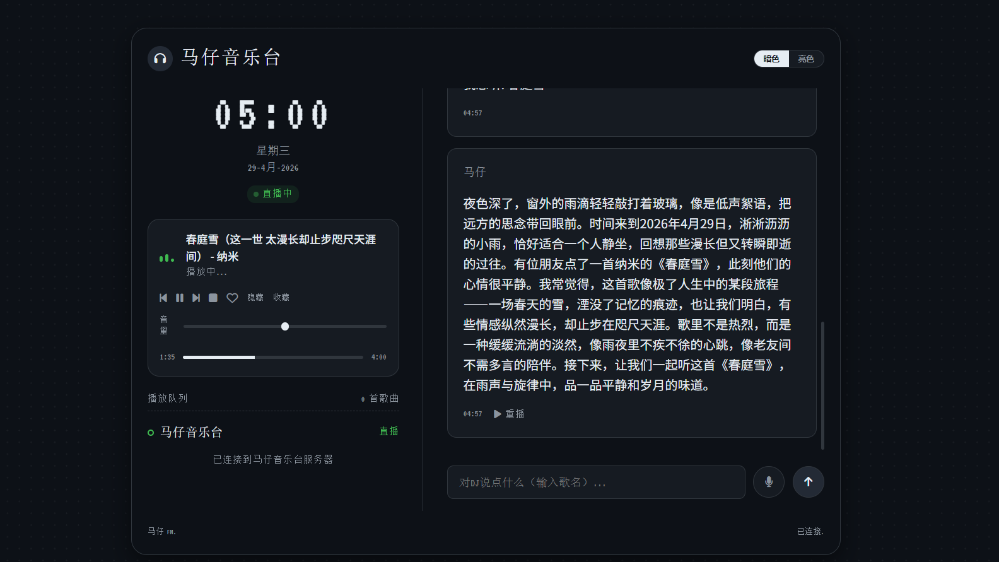

# 马仔音乐台 (AI DJ 点歌系统)

这是一款复古风格的 AI DJ 点歌系统。用户输入想听的歌名后，系统会：
1. 自动从网易云音乐检索歌曲并获取播放链接。
2. 调用大模型 (OpenAI 兼容接口) 生成结合当前天气和心情的专属 DJ 串词。
3. 通过 TTS 将串词转为语音播报。
4. 播报结束后无缝衔接播放所点歌曲。

## 界面预览



## 特性

- **复古点阵 UI**：参考 Claudio 风格，支持亮色/暗色主题无缝切换。
- **智能串词生成**：每次点歌都会根据随机“天气”与“心情”生成带有电台感、故事感的 DJ 独白。
- **全自动 TTS 播报**：播报串词期间强制最大音量（音乐静音/微弱背景音），播报结束后自动播放音乐本体。
- **网易云音乐解析**：接入网易云音乐 Web 搜索 API。

---

## 本地开发运行

1. **环境准备**：
   请确保本地已安装 Python 3.10+。
   
2. **配置环境变量**：
   在项目根目录创建 `.env` 文件（已加入 `.gitignore`），写入：
   ```bash
   OPENAI_API_KEY=你的Key
   OPENAI_BASE_URL=https://api.laozhang.ai/v1
   ```
   其中 `OPENAI_BASE_URL` 可选，不填则默认使用 `https://api.laozhang.ai/v1`。

3. **安装依赖**：
   ```bash
   pip install -r requirements.txt
   ```

4. **运行服务**：
   ```bash
   uvicorn main:app --host 0.0.0.0 --port 8000
   ```
   然后打开浏览器访问 `http://localhost:8000` 即可体验。

---

## Docker 部署 (推荐)

项目已内置了完整的 Docker 构建配置，建议使用 `docker-compose` 一键拉起：

1. **安装 Docker** 和 **Docker Compose**。
2. 在项目根目录执行：
   ```bash
   # 方式一：导出环境变量
   # Windows PowerShell:
   #   $env:OPENAI_API_KEY="你的Key"
   # Linux/macOS:
   #   export OPENAI_API_KEY="你的Key"
   # 可选：export OPENAI_BASE_URL="https://api.laozhang.ai/v1"
   #
   docker-compose up -d
   ```
3. 等待镜像构建并启动完成后，访问：
   ```
   http://<你的服务器IP>:8000
   ```

### 目录结构说明

- `main.py`：FastAPI 后端路由核心逻辑（API 请求、大模型调用、网易云解析）。
- `static/`：静态资源目录
  - `index.html`：前端页面结构。
  - `css/style.css`：暗色/亮色双主题样式。
  - `js/app.js`：前端音频控制与聊天交互逻辑。
  - `audio/`：生成的 TTS MP3 语音存放目录（在 Docker 中已挂载持久化）。
- `ai.py` & `tts.py`：测试用的原生脚本（可参考调用逻辑）。

---

## 许可证

MIT License
